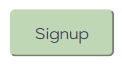
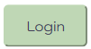
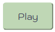
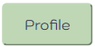
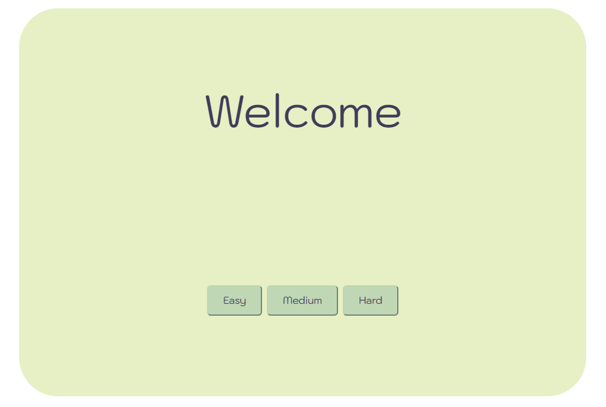
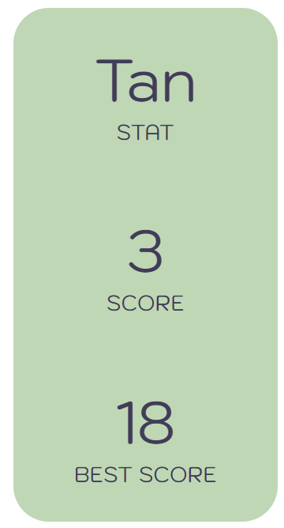
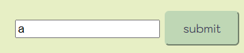
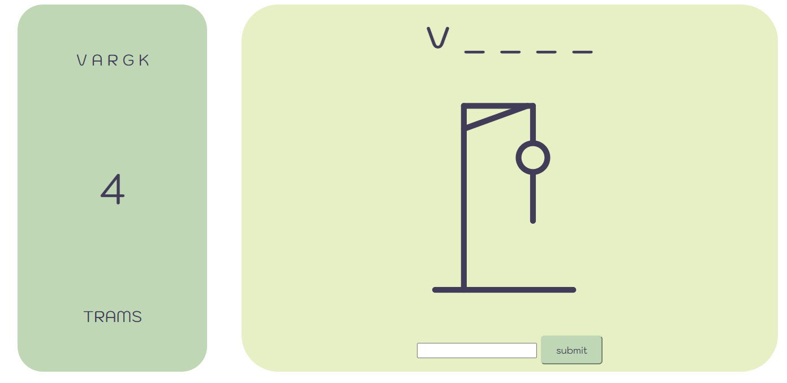
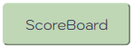
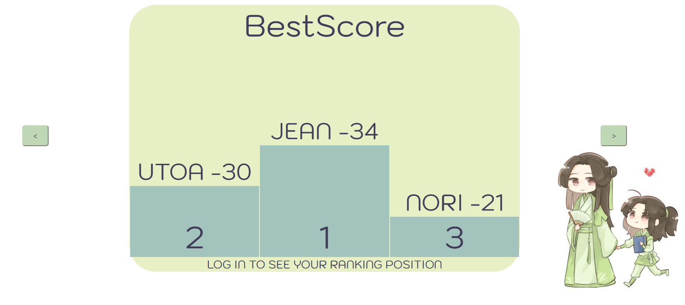

# HangManWeb

Hangman is a classic word guessing game where players have to guess a word by suggesting letters. Guess correctly to prevent the character from being hanged! A fun game to test your vocabulary and deduction skills.

***
## Table of contents

- [Installation](#installation)
- [Depployment](#depployment)
- [Using the Hangman game](#using-the-hangman-game)
- [Licence](#license)

***
## Installation

Before that, you'll need to download golang
https://go.dev/doc/install

Next, open a terminal and enter the following commands :

```bash
$ git clone https://ytrack.learn.ynov.com/git/rsoleane/hangman-web.git
$ cd hangman-web
$ go build -o hangmanweb
```

***
## Depployment

To play the game, you'll first need to launch it on the web.
To do this, still in your terminal, enter the following command:

```bash
$ ./hangmanweb
```
or

```bash
$ go run serveur.go
```

Then launch your favorite browser and enter the following url:
```
localhost:8080
```
And that's all there is to it! Now you can move on to the next step.

***
## Using the Hangman game

- [Connexion Page](#connexion-page)
- [Play](#play)
- [Score Board](#score-board)
- [Theme](#theme)


### Connexion page

Now that you've launched the game, you can either *log in*, *register* or *play without an account* !
Once you've started the game, you'll see an erface asking you to login or create an account.

#### 1. Signup

If you press the signup button,  you'll be asked to create an account with :

- An **e-mail** address
- A **username**
- A **password**
- ~~Your credit card information~~

Remember all this information, as it will be essential for reconnecting.

#### 2. Login

If you press the login button,  you'll be able to log in! If you haven't already created an account, you can click on signup and create an account.

To log in you'll need :

- Your account **email** address
- Your account **password**
- ~~Your dog's name~~

> If you've lost your password or your email address, you won't be able to retrieve them, create a new account or play without one.

#### 3. Continue without an account

If you want to continue without an account, no worries, just click on the play button in the header and you'll be able to play without an account.



***Please note! If you play without an account, your score will not be saved if you quit the game!***

If you'd like to create an account or log in later, simply click on the Profile button in the header and you'll be redirected to the login page.


### Play

#### 1. Level



Immediately after completing the above steps, you will be offered 3 levels. At the end of each game you can choose a level for the next game.

##### Easy

The easy level, by its name, is the simplest. If you win a game in easy, one point will be added to your score.

##### Medium

For the medium level, you'll be provided with a slightly more complicated word than the easy mode, which will earn you two points! Provided you guess it correctly, of course!

##### Hard

Harder words are on offer for this level! A word found will earn you three points!

#### 2. Score / BestScore



On the right-hand side of the screen, you'll see a score and a bestscore! "Score" is your current score, which increases with the number of words you find, but decreases to 0 if you lose even once! So if your current score exceeds your Bestscore, it replaces it!

#### 3. The Game

Suggest letters to find the word using the input :



Here's an example of a game in progress 



Details of the different elements :

- **Top right**: Letter you've already suggested
- **Center right**: Number of bad letters allowed before hanging
- **Bottom right**: Word you've already entered 
> Note that if you submit the wrong word, you lose two attempts.
- **Top left**: Word to be found
- **Center left**: Hangman that appears as you submit the wrong word.
- **Bottom left**: Submit


### ScoreBoard

To access the scoreboard, simply click on the ScoreBoard button at the top of the page.


Here's an example of the scoreboard that might appear:



You can see "<" & ">" on the left and right, and by clicking on them you can change statistics. Here you have the BestScore podium, but there are many other podiums:

> - Win: those who have won the most times (on all difficulties)  
> - Lose: Those who have lost the most games... 
> - Ratio: Number of games won vs. lost
> - BestScore: Highest number of points accumulated by a player (more on points later in the readme).
> - WinHard: Podium of those who have won the most games with the hard level
> - WinMedium: Podium for those who have won the most games with level medium
> - WinEasy: Podium for those who won the most games with level easy

On each podium step you can see the user's nickname and score, and below the podium you can see your position. If you're not logged in, your position won't be displayed (see example above).


### Theme

Still in the header you can access different themes, select one and press the "ok" button to change theme!


> Four themes are proposed, referring to characters from the works of *Mo Xiang Tong Xiu*.

The **four themes** you could access are :

- **Lan Zhan**: Be immersed in the sky and clouds with this blue-hued theme.
- **Wei Wing**: The darkest theme in the palette, offering shades of red and black. 
- **Pei Ming**: Also known as the "coffee" theme, this one will suit you if you like brown and beige hues.
- **Shen Qing Qiu**: With different shades of green, this theme will give you a breath of fresh air in nature!

> The default theme is *Shen Qing Qiu*


***
## License

This game is protected by copyright and is under a proprietary license. Any use, distribution, or modification of this game without prior authorization from Rivier Soleane is strictly prohibited. For licensing or permission inquiries, please contact us at soleane.rivier@ynov.com.

All rights reserved © 2023


https://www.figma.com/file/ayACovoKxyLbiOQB04UGe2/Untitled?type=design&node-id=1%3A4&mode=design&t=XSHp3RiS6W69BWZP-1